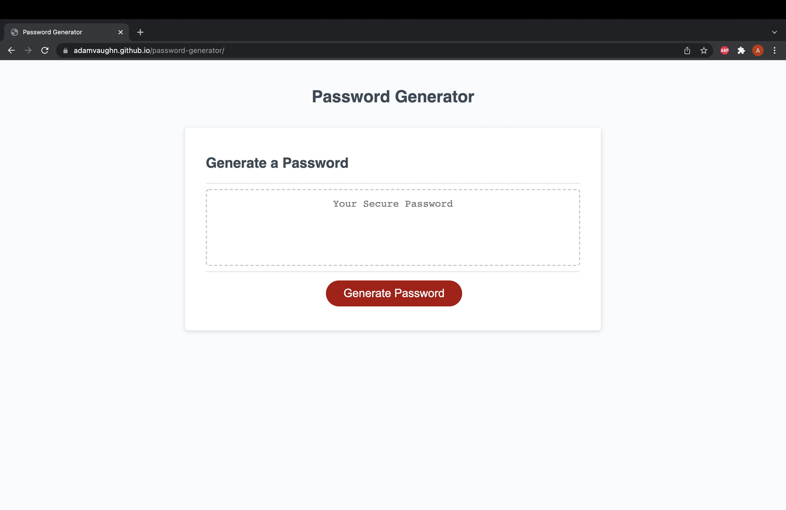

# **Password Generator**

### This application allows user to generate a random password with the following parameters:

* Choose between 8-128 characters
* Lowercase
* Uppercase
* Numbers
* Special Characters

#### If number of characters do not fall within range or there are no character types selected user will be prompted to try again.

</img>

### Contact
Adam Vaughn - adamdvaughn@gmail.com

Project Link - https://github.com/adamvaughn/password-generator